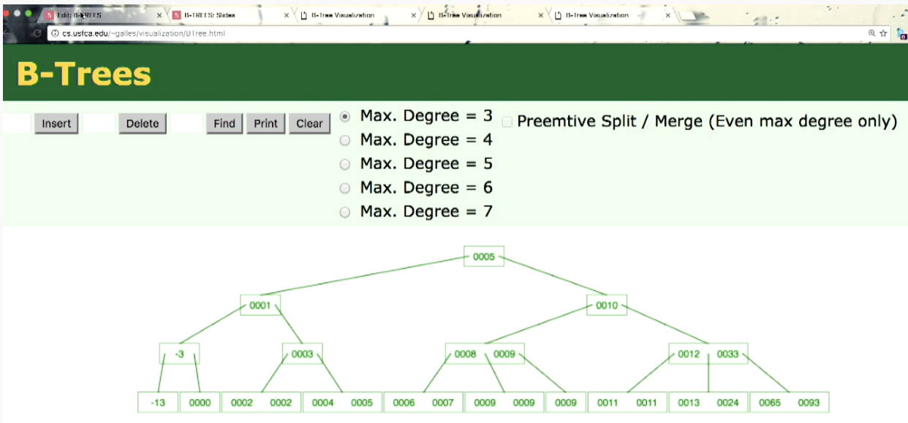

인덱스의 필요성.

인덱스의 장단점?
검색은 빠르지만 업데이트,삭제가 느리다.
#
전체 탐색(O(N))->💩No

해시 테이블(O(1)) ->일부 범위 검색 불가... <= 등...

binary search tree...?O(logN) ->밸런스가 안맞는 경우 O(N)

✨ b-tree (이진트리면 O(logN)이지만 b-tree는 다중허용->o(logmn)으로 이진트리보다 계층깊이를 얕게했다.) 

루트 - 브랜치 - 리프 로 범위로 찾는다

b+tree의 경우는 리프단계로 가야 데이터 위치가 있다.

  

# b-tree VS b+tree
... to be continued...(🐛🐛🐛)

#
* 아래내용 출처: https://www.youtube.com/watch?v=C_q5ccN84C8
  
### Balanced Binary Search Tree : O(LogN)
### Unbalanced BST: O(N) for search, insert, and delete operations
->🧘🏻‍♀️ Self balancing tree... => B-Tree

  

아래 트리에 -3을 삽입하면?

  