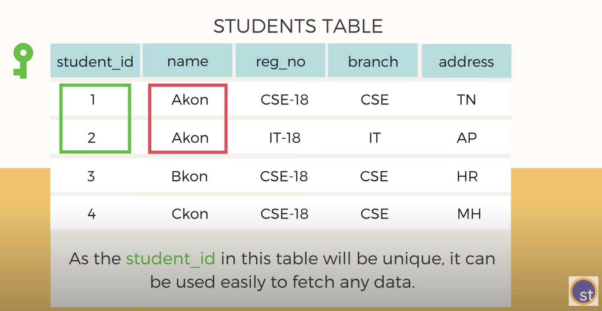
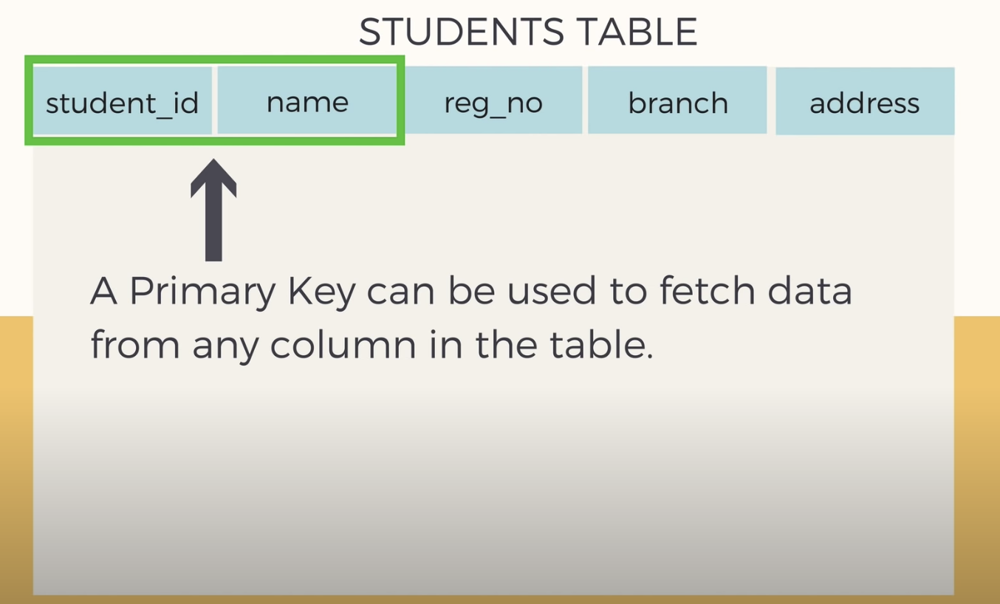
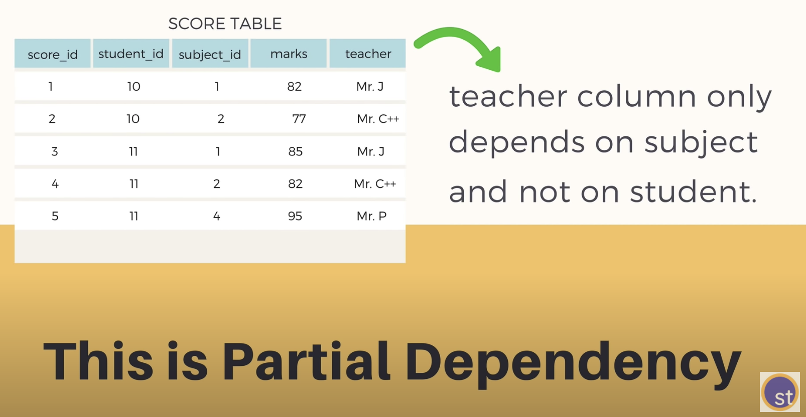
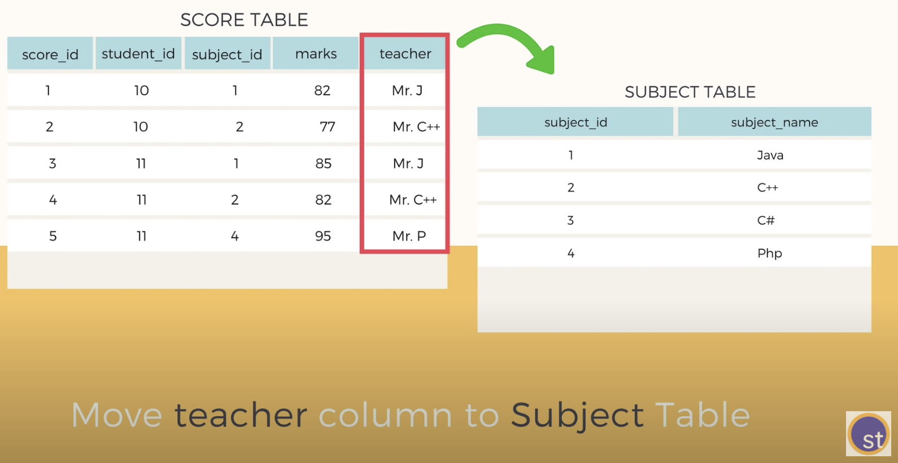

# 관계형 데이터베이스에서 중복을 최소화하기 위해 데이터를 구조화하는 작업

`normalization` is
a technique to organize data -> multiple related tables
to minimize DATA REDUNDANCY

* PROBLEMS - DATA REDUNDANCY
- repeticion of data increases the size of db
- others... ( - insertion, updation, deletion problems)

* Insertion Anomaly
To insert redundant data for every new row

* Deletion Anomaly
Loss of a related dataset when some other dataset is deleted.

* Updation Anomaly
Having to update a column for all the lows || missing updating one -> data inconsistency

normalization is NOT eleminating Redundancy
BUT minimizing Redundancy
=>Fewer problems in inserting, deleting, and updating the data

DIVIDE AND RULE
---
Types of Normalization
1. 1st Normal Form
-Every table in your db should at least follow the 1st normal form, always.
(1)Each column should contain atomic values
(2)A Column should contain values that are of the same type. ex)birthday: 16-10-1991,...
(3)Each column should have a unique name.
(4)Order in which data is saved doesn't matter

2. 2nd Normal Form
https://youtu.be/R7UblSu4744
 (1) It should be in 1st Normal Form
 (2) It should not have any Partial Dependencies.
What is dependency?

Below student table, every coulum data is dependent on student_id column(primary key) - dependency in a table

  
Then, what's partial dependency?

  
3. 3rd Normal Form
4. BCNF

...
Database Design for Mere Mortals: A Hands-On Guide to Relational Database Design
https://www.amazon.com/Database-Design-Mere-Mortals-Hands/dp/0321884493/ref=sr_1_1?dchild=1&keywords=Database+Design+for+Mere+Mortals&qid=1612316902&sr=8-1