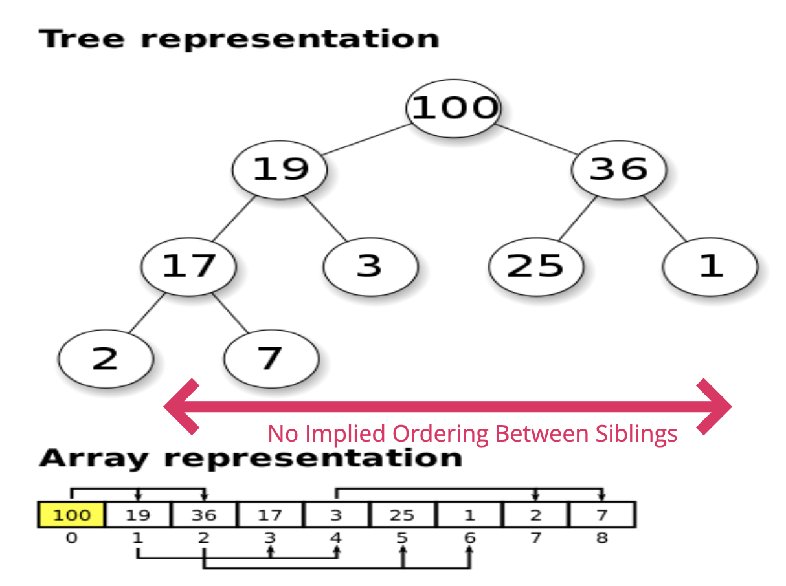

3. Analyzing Performance of Arrays and Objects

5. Problem Sorving Patterns

7. Recursion

10. Searching Algorithms

11. Bubble Sort

12. Insertion Sort

13. Insertion Sort

14. Comparing Bubble, Selection, and Insertion Sort

15. Merge Sort

16. Quick Sort

17. Radix Sort

---

18. DataStructure

19. Singly Linked Lists

20. Doubly Linked Lists

21. Stack+Queues

22. Binary Search Trees

24. Binary Heaps
-Similar to binsary search trees with some different rules  
   * 1)MaxBinaryHeap: Parent node > child node  

   
   * 2)MinBinaryHeap:

   * Why? Very useful data structures for sorting, and implementing other data structures like `Priority Queues`
   - used with `graph traversal algorithms` as well.

   * parant index(n) -> child(2n+1, 2n+2)
   * child(n) -> parent: (n-1)/2 ...floored

   ## Adding to a MaxBinary Heap?

   <details><summary>Add to the end -> Bubble up 🧼</summary>
   <p>

   #### ✨!

   ```javascript
   //[55,39,41,18,27,12,33]

   class HeapMyVersion{
      constructor(){
         this.values = [41,39,33,18,27,12];
      }
      insert(val){
         this.values.push(val);
         this.bubbleUp();
         return this.values;
      }
      swap(arr, idx1, idx2) {
         [arr[idx1], arr[idx2]] = [arr[idx2], arr[idx1]];  
      } 
      bubbleUp(){
         let index = this.values.length-1;
         let parentIndex = Math.floor((index-1)/2);
         while(this.values[index]>this.values[parentIndex]){
               this.swap(this.values, index, parentIndex);
               index = parentIndex;
               parentIndex = Math.floor((index-1)/2);
         }
      }
      //REMOVING
      extractMax(){
         const max = this.values[0];
   //         this.swap(this.values, 0, this.values.length-1);
   //         this.values.pop();
         const end = this.values.pop();
         this.values[0]=end;
         //Sink Down
         this.sinkDown();
         return max;
      }
      sinkDown(){
         let parentIndex = 0;
         let leftKidIndex = 2*parentIndex +1;
         let rightKidIndex = 2*parentIndex +2;
         while(this.values[leftKidIndex]> this.values[parentIndex] 
               ||this.values[rightKidIndex]>this.values[parentIndex]){
                  let biggerKidIndex;
                  if(this.values[leftKidIndex]>=this.values[rightKidIndex]){
                     biggerKidIndex = leftKidIndex;
                  } else {
                     biggerKidIndex = rightKidIndex;
                  }
                  swap(this.values, parentIndex, biggerKidIndex);
                  parentIndex = biggerKidIndex;
                  leftKidIndex = 2*parentIndex+1;
                  rightKidIndex = 2*parentIndex+2;
         }
      }
   }


   class Heap{
      constructor(){
         this.values = [41,39,33,18,27,12];
      }
      insert(val){
         this.values.push(val);
         this.bubbleUp();
         return this.values;
      }
      swap(arr, idx1, idx2) {
         [arr[idx1], arr[idx2]] = [arr[idx2], arr[idx1]];  
      } 
      bubbleUp(){
         let index = this.values.length-1;
         let parentIndex = Math.floor((index-1)/2);
         while(this.values[index]>this.values[parentIndex]){
               this.swap(this.values, index, parentIndex);
               index = parentIndex;
               parentIndex = Math.floor((index-1)/2);
         }
      }
      //REMOVING
      extractMax(){
         const max = this.values[0];
         const end = this.values.pop();
         if(this.values.length > 0){
               this.values[0]=end;
               //Sink Down
               this.sinkDown();
         }
         return max;
      }
      sinkDown(){
         let idx = 0;
         const length = this.values.length;
         const element = this.values[0];
         while(true){
               let leftChildIdx = 2 * idx + 1;
               let rightChildIdx = 2 * idx + 2;
               let leftChild, rightChild;
               let swap = null;

               if(leftChildIdx<length){
                  leftChild = this.values[leftChildIdx];
                  if(leftChild > element) {
                     swap = leftChildIdx;
                  }
               }
               if(rightChildIdx<length){
                  rightChild = this.values[rightChildIdx];
                  if( //걍 rightChild >leftChild 는 안될까?? 궁금
                     (swap === null && rightChild > element) ||
                     (swap !== null && rightChild > leftChild)
                  ) {
                     swap = rightChildIdx;
                  }
               }
               
               if(swap === null) break;
               this.values[idx] = this.values[swap];
               this.values[swap] = element;
               idx = swap;

         }
      }
   }

   var heap = new Heap();
   heap.insert(55);
   ```

   </p>
   </details>

   ## What is a Priority Queue?
   ds where each element has a priority.  
   Elements with higher priorities are served first.

   <details><summary>CLICK ME</summary>
   <p>

   #### binary heap + priority

   ```javascript
   class Node {
      constructor(val, priority){
         this.val = val;
         this.priority =priority;
      }
   }

   class PriorityQ{
      constructor(){
         this.values = [];
      }
      enqueue(val, priority){
         let newNode = new Node(val, priority);
         this.values.push(newNode);
         this.bubbleUp();
         return this.values;
      }
      
      bubbleUp(){
         let idx = this.values.length-1;
         const element = this.values[idx];
         while(idx>0){
               let parentIdx = Math.floor((idx-1)/2);
               let parent = this.values[parentIdx];
               if(element.priority >= parent.priority) break;
               this.values[idx] = parent;
               this.values[parentIdx] = element;
               idx = parentIdx;
         }
      }
      //REMOVING
      dequeue(){
         const min = this.values[0];
         const end = this.values.pop();
         if(this.values.length > 0){
               this.values[0]=end;
               //Sink Down
               this.sinkDown();
         }
         return min;
      }
      sinkDown(){
         let idx = 0;
         const length = this.values.length;
         const element = this.values[0];
         while(true){
               let leftChildIdx = 2 * idx + 1;
               let rightChildIdx = 2 * idx + 2;
               let leftChild, rightChild;
               let swap = null;

               if(leftChildIdx<length){
                  leftChild = this.values[leftChildIdx];
                  if(leftChild.priority < element.priority) {
                     swap = leftChildIdx;
                  }
               }
               if(rightChildIdx<length){
                  rightChild = this.values[rightChildIdx];
                  if( //걍 rightChild >leftChild 는 안될까?? 궁금
                     (swap === null && rightChild.priority < element.priority) ||
                     (swap !== null && rightChild.priority < leftChild.priority)
                  ) {
                     swap = rightChildIdx;
                  }
               }
               
               if(swap === null) break;
               this.values[idx] = this.values[swap];
               this.values[swap] = element;
               idx = swap;

         }
      }
   }

   var ER = new PriorityQ();
   ER.enqueue("common cold", 5);
   ER.enqueue("Gunshot wound", 1);
   ER.enqueue("high fever", 4);
   ER.enqueue("broken arm", 2);
   ER.enqueue("glass in foot", 3);


   ```

   </p>
   </details>

   ## Big O of Binary Heaps

   <details><summary>CLICK ME</summary>
   <p>

   #### insersion - O(log N)
   #### removal - O(log N)
   #### search - O(N)

   </p>
   </details>

#
25. Hash Tables  
store key-value pairs
similar to arrays but not ordered
"Faster" for finding, adding, removing values than arrays

```
Python - Dictionaries
Js - Objects, Maps
Java, Go, Scala - Map
Ruby - Hashes
```

* Good Hash?
1. Fast(constant time)
2. Distributes uniformly
3. Deterministic(same input -> same output)

## Simple Hashing->improved Hashing
   ...🏋🏻‍♀️

   <details><summary>CLICK ME</summary>
   <p>

   #### babyHash <-> hash

   ```javascript
   function babyHash(key, arrayLen) {
    let total = 0;
    for( let char of key ){ // 💩 not constant time - linear in key length
        //map "a" to 1, b to "2", "c" to 3, etc.
        let value = char.charCodeAt(0) - 96;
        total = (total + value) % arrayLen; //💩 could be a bit more random
    }
    return total;
   }


   function hash(key, arrayLen) {
      let total = 0;
      // ✨ prime numbers help in spreading out the keys more uniformly
      let WEIRD_PRIME = 31; 
      for( let i = 0; i < Math.min(key.length, 100); i++){ //✨
         let char = key[i];
         let value = char.charCodeAt(0) - 96;
         total = (total * WEIRD_PRIME + value) % arrayLen; //✨
      }
      return total;
   }

   ```

   </p>
   </details>

#
26. Graphs

27. Graph Traversal

28. Dijkstra's Algorithm!

29. Dynamiac Programming